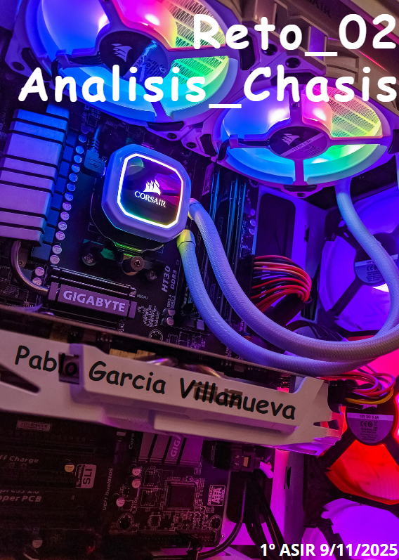
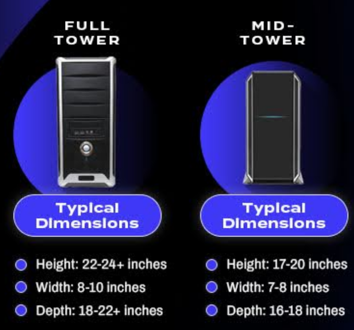

# Reto 02 — Análisis de Chasis (UT2 · RA1)

> **Instrucciones:** Copia aquí el contenido final de cada sección (puedes mantener los enlaces relativos a imágenes).

COPIAR: Portada, indiccee y intorducción

## Índice

1. [Portada](00-portada.md)
2. [Introducción](02-introduccion.md)
3. [Tabla de materiales](10-tabla_materiales/tu_tabla_materiales.md)
4. [Formatos y diagrama](20-formatos_y_diagrama/tu_diagrama_y_analisis.md)
5. [Caso práctico](30-caso_practico/tu_resolucion_caso.md)
6. [Reflexión personal](40-reflexion_personal/tu_reflexion.md)
7. [Entrega y checklist](99-entrega_y_checklist.md)

## Introducción

En este documento analizamos **materiales** (acero SECC, aluminio, plástico, vidrio templado y compuestos) y **formatos** de chasis (p. ej., Torre Completa vs Mini Torre), para entender cómo afectan a **capacidad de componentes**, **refrigeración** y **experiencia de usuario**. Finalmente, resolvemos un **caso práctico** de recomendación.

## 1) Tabla comparativa de materiales de chasis

(Completa esta tabla partiendo de `plantilla_tabla.md`)

| Material            | Ventajas (3)                                                  | Desventajas (3)                                          | Aplicaciones comunes (ejemplos)                      |
|---------------------|---------------------------------------------------------------|----------------------------------------------------------|------------------------------------------------------|
| **Acero SECC**      | Estructura sólida y estable · Reduce vibraciones y ruido · Soporta piezas pesadas | Pesado para mover o limpiar · Se oxida si se daña el recubrimiento · Difícil de perforar o modificar | Cajas estándar y robustas · Torres ATX de oficina o gaming |
| **Aluminio**        | Muy ligero y fácil de manejar · Disipa mejor el calor · No se oxida | Menor aislamiento acústico · Se raya fácilmente · Más caro | Cajas premium y ligeras · Equipos de alto rendimiento |
| **Plástico**        | Ligero y fácil de desmontar · No conduce electricidad · Económico | Se rompe con facilidad · Retiene polvo estático · Baja resistencia al calor | Frontal y tapas de cajas · Cajas económicas o modulares |
| **Vidrio templado** | Estético y resistente a rayaduras · Fácil de limpiar · No interfiere con iluminación RGB | Muy pesado · Frágil ante golpes o torsión · Retiene huellas | Panel lateral o frontal transparente · Cajas gaming con iluminación |
| **Materiales comp.**| Ligeros y resistentes · Buen aislamiento térmico/acústico · No se oxidan | Precio elevado · Difícil de sustituir o reparar · Poca disponibilidad | Cajas de gama alta o personalizadas · Chasis silenciosos |

## 2)Formatos de chasis: diagrama y análisis

**Formatos elegidos:** Full tower vs mid tower

### Diagrama

### Impacto del tamaño
| Característica              | **Full Tower**                                                                 | **Mid Tower**                                                              |
|-----------------------------|--------------------------------------------------------------------------------|----------------------------------------------------------------------------|
| **Capacidad de componentes** | _Muy alta_: admite placas E-ATX, varias GPU, múltiples discos duros y refrigeración líquida grande. | _Alta_: compatible con placas ATX y Micro-ATX, 1–2 GPU y buena capacidad de almacenamiento. |
| **Refrigeración**            | _Excelente_: gran flujo de aire y espacio para varios ventiladores o radiadores grandes. | _Buena_: flujo de aire equilibrado, pero con menos espacio para ventiladores o radiadores grandes. |
| **Uso típico**               | Equipos gaming de alto rendimiento, estaciones de trabajo o configuraciones personalizadas avanzadas. | PCs de escritorio potentes, gaming estándar y equipos de uso general. |

## 3) Caso práctico
**Necesidades del cliente:**  
- Máxima capacidad de almacenamiento (varios HDD/SSD)  
- Múltiples tarjetas gráficas (diseño/simulación)  
- Buena refrigeración  

### 1) Formato recomendado  
**Elección:** 🧱 **Full Tower**  

**Por qué:**  
Ofrece el **mayor espacio interior**, permitiendo instalar **placas base E-ATX**, **varias tarjetas gráficas** y **numerosos discos duros o SSD**.  
Dispone de **múltiples bahías** y espacio para **radiadores grandes o varios ventiladores**, lo que mejora la **refrigeración general**.  
Además, facilita una **excelente gestión del cableado**, manteniendo el flujo de aire limpio y el montaje más ordenado.  

### 2) Material recomendado  
**Elección:** ⚙️ **Acero SECC con paneles de aluminio o vidrio templado**  

**Por qué:**  
El **acero SECC** proporciona **alta rigidez y estabilidad estructural**, ideal para soportar el peso de varios componentes sin vibraciones.  
El **aluminio** mejora la **disipación térmica** y reduce ligeramente el peso, mientras que el **vidrio templado** aporta una **estética premium** sin afectar al rendimiento.  
En conjunto, ofrecen una **buena relación entre coste, resistencia, refrigeración y diseño profesional**.  

## 4) Reflexión personal
El chasis de un ordenador no es solo espacio en el que guardar componentes, tiene un impacto directo en la **experiencia del usuario**. Un punto importante es el **ruido** que hacen los componentes como el disipador; los materiales más gruesos o paneles con aislamiento ayudan a reducir vibraciones y el sonido de ventiladores y discos, haciendo el equipo más silencioso. La **temperatura** también depende del diseño del chasis: un buen flujo de aire, espacio suficiente para ventiladores o radiadores y filtros de polvo mantienen los componentes frescos y estables. El **acceso a puertos** es clave; chasis con puertos frontales o superiores bien situados permiten conectar rápidamente los periféricos sin necesidad de mover la torre mientras que los traseros son de mayor transmision pensados para perifericos mas "permanentes" como lo son teclado y raton. Por último, la **estética** también influye a nivel de satisfacción del usuario: materiales como aluminio, acero o vidrio templado, combinados con iluminación RGB o acabados pulidos, hacen que el equipo, no sólo funcione bien, sino que a su vez se vea profesional y atractivo. Un chasis bien diseñado mejora rendimiento, comodidad y satisfacción general del usuario.
