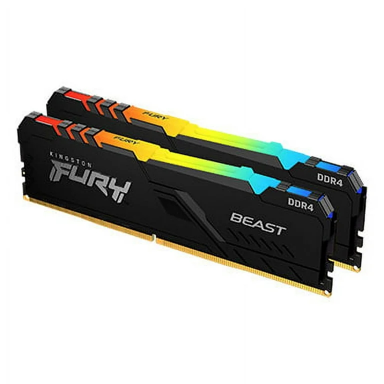
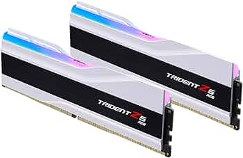
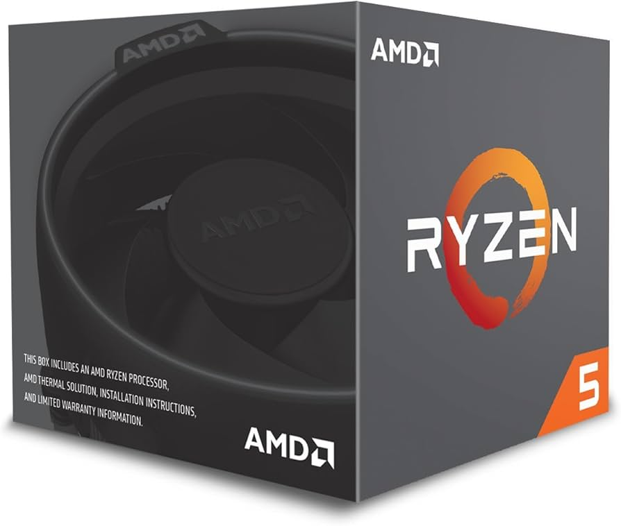
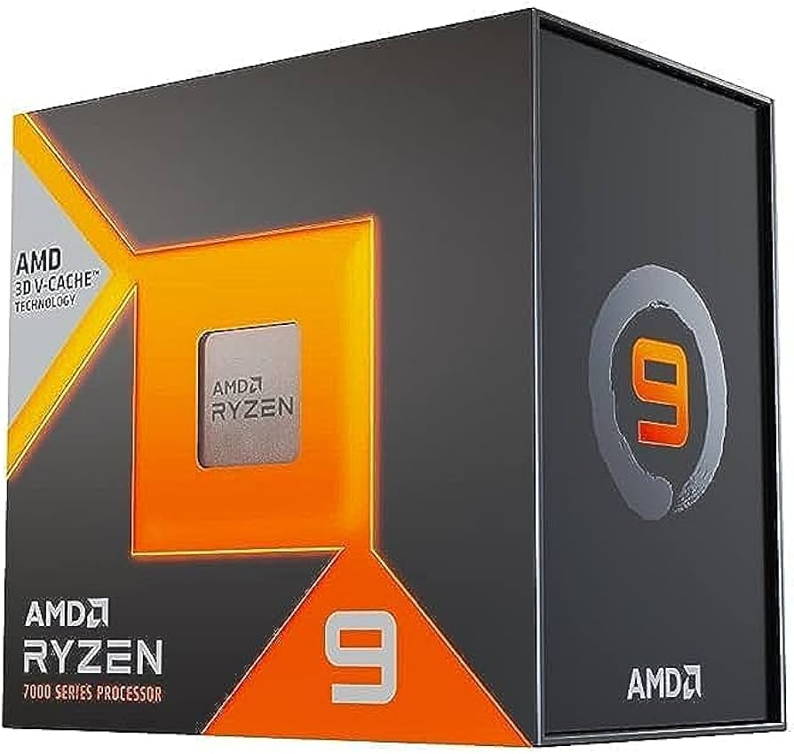

# Parte 2 — Selección y comparación de componentes (único archivo)

> **Instrucciones generales**  
> 1) **Todo en este único archivo**.  
> 2) Las capturas guárdalas en `assets/img/20-parte2/` y enlázalas con ruta relativa.  
> 3) Cita **URL** de cada ficha y justifica la elección según **oficina** o **gaming**.  

---

## 1) Búsqueda de componentes (tienda online)
Elige una o varias tiendas (p. ej., **PcComponentes**, **Amazon ES**, **LDLC ES**). Completa las **4 fichas** siguientes.

> **Notas:** El precio indicado para los componentes es el consultado el **07 de diciembre de 2025**.

### 1.1 Memoria RAM — PC de oficina

| Campo | Valor |
|---|---|
| **Marca y modelo** | Kingston FURY Beast DDR4 3200 MHz 16GB 2x8GB CL16 |
| **Capacidad** | 16 GB (Kit de 2 x 8 GB) |
| **Velocidad / Timings** | 3200 MT/s / CL16 (CL16-20-20) |
| **Tipo (DDR4/DDR5) y formato (DIMM/SO-DIMM)** | DDR4 DIMM |
| **Precio (€)** | 116,95 € (Precio consultado en PcComponentes) |
| **URL** | https://www.pccomponentes.com/kingston-fury-beast-ddr4-3200-mhz-16gb-2x8gb-cl16 |
| **Captura** |  |
| **Justificación** | Para un PC de **oficina**, esta memoria es ideal por su equilibrio entre coste, capacidad y rendimiento. 16 GB en configuración **Dual Channel** (2x8GB) garantiza la **multitarea fluida** (navegador con múltiples pestañas, ofimática y videollamadas) sin necesidad de recurrir a la paginación. La velocidad de 3200 MT/s es el punto dulce de la **DDR4**, asegurando **estabilidad** y **compatibilidad** en la mayoría de placas base económicas modernas (Intel LGA 1200/1700 y AMD AM4). El perfil CL16, aunque no es el más bajo, ofrece una latencia adecuada para un uso general sin incurrir en costes innecesariamente altos. |

### 1.2 Memoria RAM — PC gaming

| Campo | Valor |
| :--- | :--- |
| **Marca y modelo** | G.Skill Trident Z5 RGB 64GB (2x32GB) 6400MHz CL32 |
| **Capacidad** | 64 GB (Kit de 2 x 32 GB) |
| **Velocidad / Timings** | 6400 MT/s / CL32 (32-39-39-102) |
| **Tipo y formato** | DDR5 DIMM |
| **Precio (€)** | 418,99 € |
| **URL** | https://www.idealo.es/precios/202249571/corsair-vengeance-rgb-32gb-kit-ddr5-6000-cl30-cmh32gx5m2b6000z30k.html |
| **Captura** |  |
| **Justificación** | Esta es la **capacidad máxima práctica** para un sistema *flagship* sin sacrificar demasiada velocidad. 64 GB elimina cualquier limitación de memoria para **workstations, edición de video 8K, renderizado 3D** o **multitarea extrema** con máquinas virtuales. La velocidad de **6400 MHz** es excepcionalmente alta para un kit de 2x32GB, ofreciendo el mejor equilibrio entre capacidad, **ancho de banda** y baja latencia (CL32). Es esencial usar una placa base Z790 o X670E de alta gama para garantizar la estabilidad a esta velocidad con perfiles XMP/EXPO. |

### 1.3 Microprocesador — PC de oficina

| Campo | Valor |
|---|---|
| **Marca y modelo** | AMD Ryzen 5 2600 |
| **Núcleos / Hilos** | 6 Núcleos / 12 Hilos |
| **Frecuencias (base/boost)** | 3.4 GHz (Base) / 3.9 GHz (Boost Máx.) |
| **Gráficos integrados** | No incluye gráficos integrados |
| **TDP / Consumo** | 65W TDP |
| **Precio (€)** | 58 €  |
| **Socket / Compatibilidad** | AMD Socket AM4 / Compatible con DDR4 |
| **URL** | https://www.pccomponentes.com/procesador-amd-ryzen-5-2600-34-ghz |
| **Captura** |  |
| **Justificación** | El Ryzen 5 2600 es un procesador **muy económico y fiable** para un PC de **oficina**, ofreciendo **6 núcleos y 12 hilos**, más que suficientes para tareas como **ofimática, navegación, multitarea ligera y videollamadas**. Su **bajo TDP de 65W** lo hace eficiente y fácil de refrigerar. Aunque **no tiene gráficos integrados**, su plataforma **AM4 con DDR4** es extremadamente barata y permite montar equipos de oficina sólidos a muy bajo coste. |

### 1.4 Microprocesador — PC gaming

| Campo | Valor |
| :--- | :--- |
| **Marca y modelo** | AMD Ryzen 9 7950X3D |
| **Núcleos / Hilos** |16 Núcleos / 32 Hilos |
| **Frecuencias (base/boost)** | 4.2 GHz (Base) / 5.7 GHz (Boost Máx.) |
| **Caché** | 128 MB L3 Cache (Dual CCD con 3D V-Cache) |
| **Socket / Compatibilidad** | AMD Socket AM5 / Requiere DDR5 |
| **Precio (€)** | 729,95 € |
| **URL** | https://www.neobyte.es/amd-ryzen-9-7950x3d-procesador-am5-18676.html |
| **Captura** |  |
| **Justificación** | Es el tope de gama de AMD, ofreciendo la **combinación definitiva** de potencia bruta (16 núcleos) para tareas profesionales pesadas y **3D V-Cache** para un rendimiento superior en gaming. Su alta frecuencia de boost y la gran cantidad de caché lo convierten en el líder en **multitarea extrema** y aplicaciones de *workstation*. Requiere refrigeración líquida de alto rendimiento. |

---

## 2) Tabla comparativa — Tipos de RAM encontrados
Compara **al menos DDR4 vs DDR5**. Si has encontrado más variaciones (p. ej. distintas velocidades), amplía filas.

| Tipo RAM | Velocidad típica (MT/s) | Voltaje típico | Consumo/eficiencia | Precio por GB (aprox.) | Compatibilidad con placas | Observaciones |
|---|---:|---:|---:|---:|---|---|
| DDR4 (Estandar) | 3200 MT/s | ~1.2 V | Eficiencia estándar | 7.31 €/GB | Placas DDR4 (Intel 10–13 gen, AMD AM4) | Máxima estabilidad y menor coste de entrada. Mínima inversión para equipos de trabajo. |
| DDR4 (alta velocidad) | 3600–4000 MT/s | ~1.35 V | Similar a DDR4 estándar, con mejor rendimiento para sistemas AMD Ryzen (Infinity Fabric). | 9–11 €/GB | Placas DDR4 compatibles con overclock (XMP) | Alto rendimiento en DDR4. Recomendado para gaming en presupuestos ajustados. |
| DDR5 (Estándar) | 4800–6000 MT/s | ~1.1 V | Más eficiente que DDR4 (PMIC integrado en el módulo). | 11–13 €/GB | Placas DDR5 (Intel 12–14 gen, AMD AM5) | Ofrece un ancho de banda significativamente mayor y mejor rendimiento general/futuro. |
| DDR5 (Gaming/Alto Rendimiento) | 6000–7200+ MT/s | ~1.25 V (con XMP/EXPO) | Alta eficiencia con la mejor **latencia ajustada** (CL30 o menor) y alto ancho de banda. | 13.36 €/GB | Placas DDR5 de alta gama compatibles con altos perfiles de **OC/XMP/EXPO**. | Esencial para **maximizar los FPS** en juegos modernos de alto requerimiento de CPU. |

> Referencia rápida: documenta **placas base compatibles** y si tu CPU escogida admite el tipo de RAM.
- La CPU de oficina no soporta DDR5 y la de gamimg no soporta la DDR4
---

## 3) Investigación — DDR5
## Comparativa DDR5 frente a DDR4

### 1. Ventajas de DDR5 frente a DDR4

DDR5 (Double Data Rate 5) es la nueva generación de memoria RAM que mejora a su predecesora, DDR4, en varios aspectos clave, haciéndola más rápida y eficiente.
| Mejora | Explicación Sencilla |
| :--- | :--- |
| **Mayor Ancho de Banda (Velocidad)** | DDR5 arranca con velocidades base más altas (ej: 4800 MT/s) que las máximas de DDR4 (ej: 3200 MT/s). Esto permite que la CPU acceda a los datos mucho más rápido, lo que es crucial para los procesadores modernos. |
| **PMIC Integrado** | En DDR4, la gestión de energía se hacía desde la placa base. En DDR5, cada módulo de memoria incluye un **PMIC** (*Power Management Integrated Circuit*). Esto permite que el módulo gestione su propio voltaje de manera más eficiente y precisa, mejorando la estabilidad y el potencial de *overclocking*. |
| **Organización Interna (Bancos)** | DDR5 tiene el doble de bancos de memoria que DDR4 (32 frente a 16). Esto le permite manejar muchas más "peticiones" de datos al mismo tiempo, mejorando la **eficiencia en la multitarea** y la velocidad de acceso en general. |
| **ECC *On-Die*** | DDR5 incluye internamente corrección de errores (ECC *on-die*). Esto ayuda a detectar y corregir errores **dentro del propio chip** antes de que los datos lleguen a la CPU, resultando en una mayor **fiabilidad** y estabilidad a altas velocidades. |
| **Perfiles de *Overclock*** | Los nuevos estándares, como **[Intel XMP 3.0](https://www.intel.es/content/www/es/es/gaming/xmp-3-0-extreme-memory-profile.html)** y **[AMD EXPO](https://www.amd.com/es/technologies/expo)**, permiten guardar más perfiles de *overclocking* directamente en el módulo, facilitando al usuario configurar la memoria a sus velocidades máximas de forma sencilla. |
| **Doble de Canales (por Módulo)** | A diferencia de DDR4, que usa un solo canal de 64 bits por módulo, DDR5 divide el módulo en **dos canales independientes** de 32 bits. Esto mejora la eficiencia al permitir que la CPU envíe dos tareas más pequeñas a un solo módulo en paralelo. |

### 2. Usos donde se nota realmente la diferencia

DDR5 brilla en escenarios donde la **CPU y la velocidad de acceso a la memoria** son el factor limitante.
* **Juegos CPU-Bound (Limitados por CPU):** En juegos de alta tasa de *frames* (FPS altos) o en simulaciones complejas donde el procesador es el cuello de botella, la **mayor velocidad y el menor *latency*** de DDR5 ayudan a la CPU a procesar los datos más rápido, aumentando los FPS de manera notable.
* **Multitarea Pesada:** La mejor organización interna permite a DDR5 gestionar de forma más eficiente la conmutación entre aplicaciones pesadas, como tener un juego abierto, el navegador y un software de *streaming* funcionando simultáneamente.
* **Creación de Contenido (Edición de Vídeo, 3D...):** En tareas de renderizado, codificación o *editing* de vídeo 4K/8K, el **mayor ancho de banda** de DDR5 permite que el procesador recupere y almacene datos de trabajo más rápido, lo que **reduce los tiempos de finalización del proyecto**.
* **Virtualización y Compresión/Descompresión:** Aplicaciones que gestionan grandes bloques de datos o sistemas operativos virtuales (máquinas virtuales) se benefician directamente del mayor ancho de banda y eficiencia.
* **Tareas de IA Ligera (Inferencia Local):** Los modelos de aprendizaje automático que se ejecutan localmente en la CPU se benefician del acceso ultrarrápido a los datos que ofrece DDR5.

### 3. Ejemplo práctico ventajoso

**Escenario:** *Gaming* de alta gama con un procesador **AMD Ryzen 7 7800X3D** (altamente dependiente de la memoria).
En la plataforma AM5 que usa este procesador, la velocidad ideal (el *sweet spot*) es **DDR5 6000 MHz CL30**.
* **Ventaja de DDR5:** La velocidad de 6000 MHz permite que el **Infinity Fabric** de la CPU (el bus interno que conecta los núcleos) funcione en **sincronía perfecta** (relación 1:1) con la memoria. Esta sincronía, junto con la baja latencia CL30, maximiza la eficiencia de la CPU. Esto se traduce directamente en un **aumento significativo de los FPS** en juegos CPU-limitados (simuladores, estrategia) y asegura que la potente **Caché 3D V-Cache** del procesador funcione a su máximo potencial. DDR5 es **fundamental** para desbloquear el rendimiento total de los procesadores más recientes.

### Fuentes

* [Intel XMP 3.0](https://www.intel.es/content/www/es/es/gaming/xmp-3-0-extreme-memory-profile.html)
* [AMD EXPO Technology](https://www.amd.com/es/technologies/expo)
* [Crucial: What is DDR5 RAM?](https://www.crucial.com/articles/about-memory)
---

## 4) Fuentes
- [TechRadar](https://www.techradar.com/features/ddr5-vs-ddr4-ram-whats-the-difference?)
- [XDA](https://www.xda-developers.com/ddr4-vs-ddr5/)
- [Navatics](https://www.navatics.com/ddr4-vs-ddr5/)
- [Wikipedia](https://es.wikipedia.org/wiki/DDR5_SDRAM)