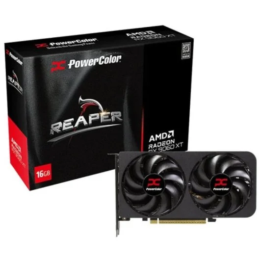
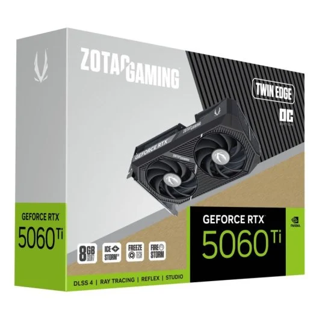
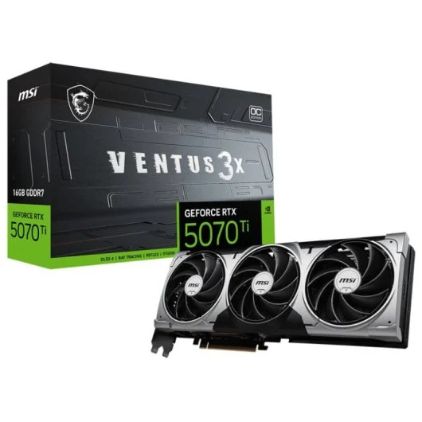
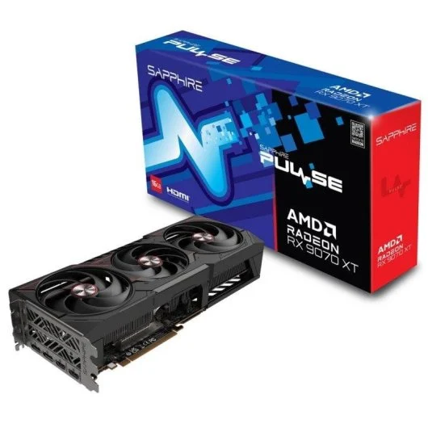

# Parte 3 — GPUs y precios reales (Black Friday 2025)
> Vídeo: **“Mejores Tarjetas Gráficas Calidad - Precio | TOP GPUs GAMING Black Friday 2025”**  
> URL: https://www.youtube.com/watch?v=ILOtkTXLUvg

## 0) Portada
- Alumno/a: Pablo Garcia Villanueva
- Grupo: ASIR1  
- Fecha: 06/12/2025

## 1) Introducción (5–10 líneas)
El video base de este trabajo ofrece dos opciones de tarjetas graficas, siendo una de la familia de NVIDIA y la otra alternativa; a continuación se va a hacer una comparativa de las tarjetas propuestas.

## 2) Tramos del vídeo y modelos mencionados
### 2.1 Tramo ~350 €
- Minuto inicio–fin: *04:46 – 07:43*
- GPUs citadas (2): ***PowerColor Reaper AMD Radeon RX 9060 XT 16GB GDDR6* y *ZOTAC GAMING GeForce RTX 5060 Ti Twin Edge OC 8GB GDDR7***

### 2.2 Tramo 600–800 €
- Minuto inicio–fin: *11:36 – 14:05*
- GPUs citadas (2): ***MSI GeForce RTX 5070 Ti VENTUS 3X OC 16GB GDDR7*** y ***Sapphire PULSE AMD Radeon RX 9070 XT 16GB GDDR6***

*¿Se repite algún modelo entre tramos?*  
No, pero en el tramo de 600–800 € se recomiendan GPUs de la misma gama que las anteriores, es decir, RX 9070 XT para AMD y RTX 5070 Ti para GeForce, ambas con 16 GB.

## 3.1 GPU del tramo 350 € — Modelo A
- Tienda: PcComponentes
- Nombre exacto: Tarjeta Gráfica PowerColor Reaper AMD Radeon RX 9060 XT 16GB GDDR6 FSR 4
- Precio (€): 405,36
- URL: https://www.pccomponentes.com/tarjeta-grafica-powercolor-reaper-amd-radeon-rx-9060-xt-16gb-gddr6-fsr-4
- Imagen: 

## 3.2 GPU del tramo 350 € — Modelo B
- Tienda: PcComponentes
- Nombre exacto: Tarjeta Gráfica ZOTAC GAMING GeForce RTX 5060 Ti Twin Edge OC 8GB GDDR7 Reflex 2 RTX AI DLSS4
- Precio (€): 396,52
- URL: https://www.pccomponentes.com/tarjeta-grafica-zotac-gaming-geforce-rtx-5060-ti-twin-edge-oc-8gb-gddr7-reflex-2-rtx-ai-dlss4
- Imagen: 

## 3.3 GPU del tramo 600–800 € — Modelo C
- Tienda: PcComponentes
- Nombre exacto: Tarjeta Gráfica MSI GeForce RTX 5070 Ti VENTUS 3X OC 16GB GDDR7 Reflex 2 RTX AI DLSS4
- Precio (€): 937,47
- URL: https://www.pccomponentes.com/tarjeta-grafica-msi-geforce-rtx-5070-ti-ventus-3x-oc-16gb-gddr7-reflex-2-rtx-ai-dlss4
- Imagen: 

## 3.4 GPU del tramo 600–800 € — Modelo D
- Tienda: PcComponentes
- Nombre exacto: Tarjeta Gráfica Sapphire PULSE AMD Radeon RX 9070 XT 16GB GDDR6 FSR 4
- Precio (€): 629,90
- URL: https://www.pccomponentes.com/tarjeta-grafica-sapphire-pulse-amd-radeon-rx-9070-xt-16gb-gddr6-fsr-4
- Imagen: 

## 4) Tabla comparativa (precios reales)
| Tramo (vídeo) | GPU (modelo del vídeo) | Tienda | Precio (€) | URL | Imagen |
|---|---|---|---:|---|---|
| 350 € | PowerColor Reaper AMD Radeon RX 9060 XT 16GB GDDR6  | PcComponentes | 405,36 | https://www.pccomponentes.com/tarjeta-grafica-powercolor-reaper-amd-radeon-rx-9060-xt-16gb-gddr6-fsr-4 |  |
| 350 € | ZOTAC GAMING GeForce RTX 5060 Ti Twin Edge OC 8GB GDDR7 | PcComponentes | 396,52 | https://www.pccomponentes.com/tarjeta-grafica-zotac-gaming-geforce-rtx-5060-ti-twin-edge-oc-8gb-gddr7-reflex-2-rtx-ai-dlss4 |  |
| 600–800 € | MSI GeForce RTX 5070 Ti VENTUS 3X OC 16GB GDDR7 | PcComponentes | 937,47 | https://www.pccomponentes.com/tarjeta-grafica-msi-geforce-rtx-5070-ti-ventus-3x-oc-16gb-gddr7-reflex-2-rtx-ai-dlss4 |  |
| 600–800 € | Sapphire PULSE AMD Radeon RX 9070 XT 16GB GDDR6 | PcComponentes | 629,90 | https://www.pccomponentes.com/tarjeta-grafica-sapphire-pulse-amd-radeon-rx-9070-xt-16gb-gddr6-fsr-4 |  |

## 5) Conclusión (5–8 líneas)
- *¿Los precios reales se parecen a lo que sugiere el vídeo?*  
  Los precios de PcComponentes difieren de los del vídeo, aunque pueden variar durante el Black Friday o en otras tiendas.  

- *¿Cuál de las cuatro ofrece mejor calidad-precio y por qué?*  
   La ***AMD RX 9070 XT*** ofrece mejor relación calidad-precio que la ***RTX 5070 Ti***, con un precio ampliamente menor y cuenta con la tecnología FSR4 que es comparable a DLSS. En el caso de necesitar algo mas economico, la ***ZOTAC RTX 5060 Ti*** destaca por su tecnología DLSS y rendimiento similar a la ***RX 9060 XT***.    

- *Observaciones finales*  
  Para presupuestos bajos, la opción más recomendable es la ***5060 Ti***. Para presupuestos mayores, la mejor calidad-precio es la ***RX 9070 XT***. Aunque tambien puede variar dependiendo del gusto del comprador 

## 6) Fuentes
- Tiendas: PcComponentes  
  - https://www.pccomponentes.com/tarjeta-grafica-powercolor-reaper-amd-radeon-rx-9060-xt-16gb-gddr6-fsr-4  
  - https://www.pccomponentes.com/tarjeta-grafica-zotac-gaming-geforce-rtx-5060-ti-twin-edge-oc-8gb-gddr7-reflex-2-rtx-ai-dlss4  
  - https://www.pccomponentes.com/tarjeta-grafica-msi-geforce-rtx-5070-ti-ventus-3x-oc-16gb-gddr7-reflex-2-rtx-ai-dlss4
  - https://www.pccomponentes.com/tarjeta-grafica-sapphire-pulse-amd-radeon-rx-9070-xt-16gb-gddr6-fsr-4
